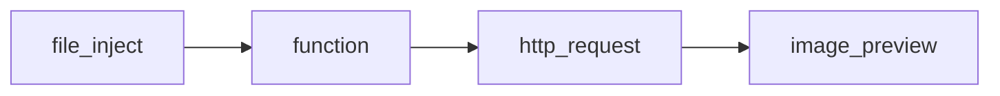

# Video App Fast API Demo 

## 教育訓練與開發環境用

1. Git clone 此 Project 

## 如何取得專案使用的 weight file 

1. 若是在教育訓練環境下，可執行 download_weight.bat
2. 若是 Azure Blob 有通的情況底下，可以利用 download_weight.sh 內的網址作擷取


# 範例說明
## 有關於 同時需要 Json 與 file 輸入的範例

1. 請見 main.py 中 StructureBase 與 draw_text_as_jpg 的相關寫法範例
2. 可於 swagger docs 或 docs2 中測試
3. 經過封裝 docker image 與 NodeRED 組裝環境 run 起該 docker container 後
4. 在 NodeRED 時，可接出以下的 flow


5. 在 NodeRED 當中調用時，前方的 function:填入參數 參考
```javascript=
msg.headers = {};
msg.headers["content-type"]="multipart/form-data"

msg.payload = {
    "data": {
        "text": "Hello, AUO NodeRED",
        "x": 10,
        "y": 120,
        "f_scaled": 1
    },
    
    "file": {
        "value": msg.payload,
        "options": {
            "filename": "FILENAME.jpg"
        }
    }
}

return msg;
```
6. 填入正確的 http request 值
    - Method: POST
    - Output: buffer
